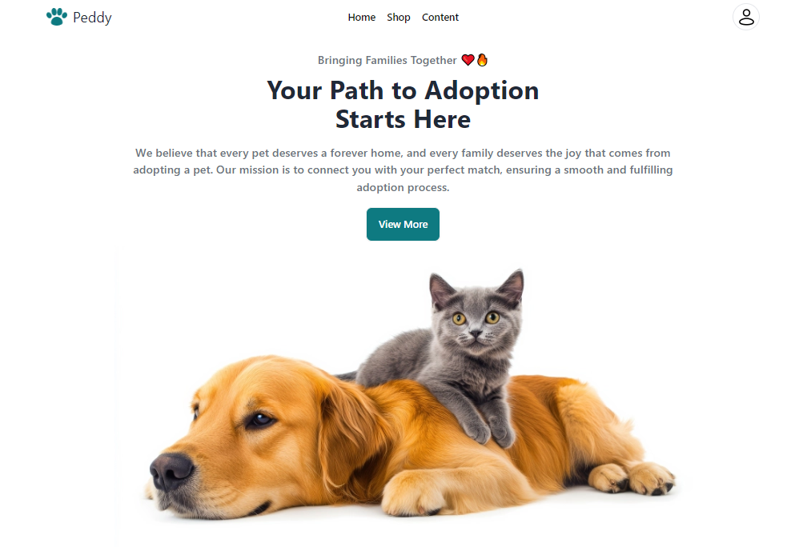
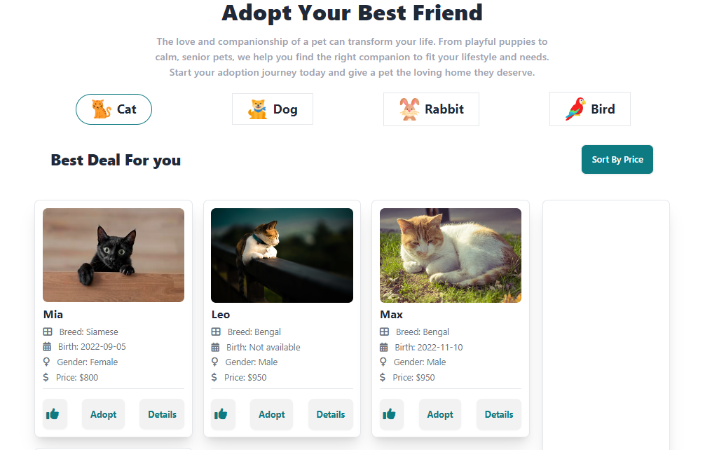
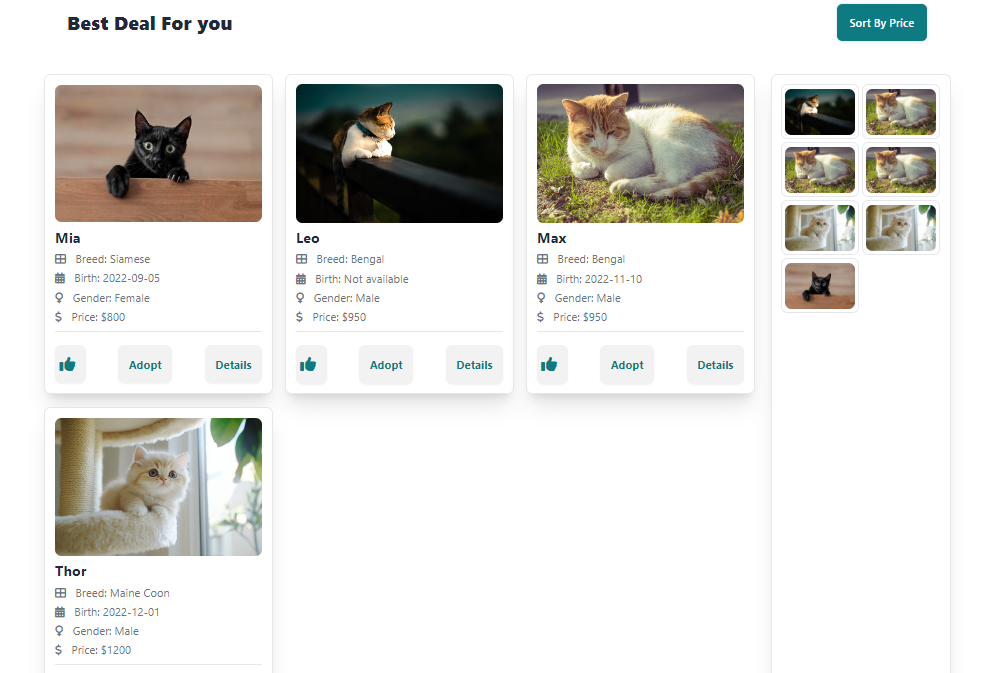
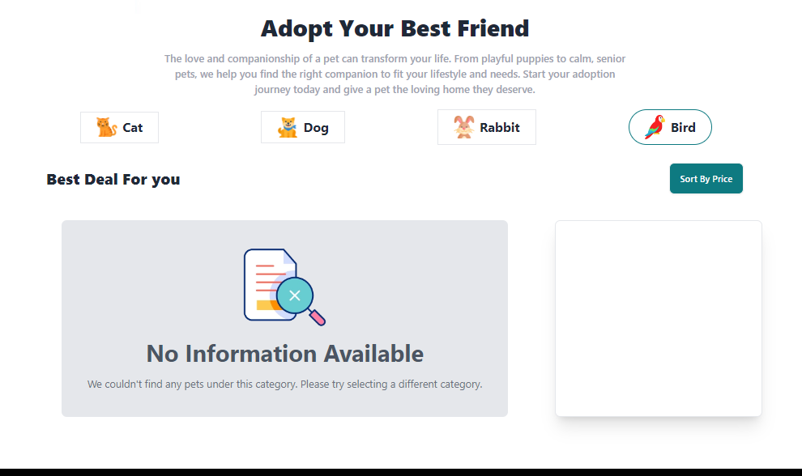

# Simple Pet Adoption Web Page (2024)

<table>
    <tr>
        <td>
            <a href="#"></a>
        </td>
        <td>
            <a href="#"></a>
        </td>
        <td>
            <a href="#"></a>
        </td>
    </tr>
</table>

Features:

- Dynamic Category Selection: Buttons allow users to filter and fetch pets by category.
- Like Button: Users can like pet images, and liked images are displayed in a dedicated section.
- No Information Modal: A modal appears when no information is available for a selected pet.
- Adopt Button: Clicking the adopt button opens a modal; after 3 seconds, adoption is confirmed, and the button is disabled.
- Price Sorting: Pet cards are sorted in descending order based on price.
- Full responsiveness

### Cloning the repository

```shell
git clone https://github.com/Crypt06545/Peddy-AS-6.git
```

## Sneak Peek of Home Page 🙈 :



<table>
  <tr>
    <td></td>
    <td></td>
  </tr>
  <tr>
    <td></td>
    <td></td>
  </tr>
</table>
