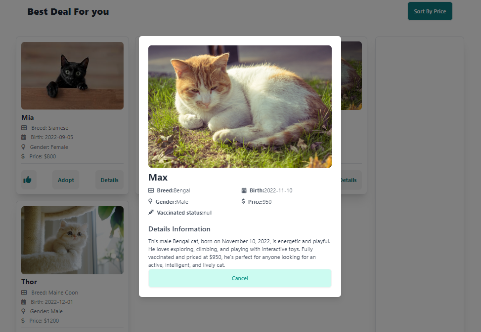

# Peddy: Simple Pet Adoption Web Page (2024)

<table>
    <tr>
        <td>
            
        </td>
        <td>
            
        </td>
        <td>
            
        </td>
    </tr>
</table>

## Project Overview

Peddy-AS-6 is a fully responsive pet adoption web page where users can explore pets by category, like their favorite pet images, and adopt them with an engaging, user-friendly experience.

## Key Features

- **Dynamic Category Selection**: Buttons to filter and fetch pets by category from an API.
- **Like Button**: Allows users to like pet images, and the liked images appear in a dedicated section.
- **No Information Modal**: A modal pops up when detailed information is missing for a selected pet.
- **Adopt Button with Countdown**: A 3-second countdown modal confirms the adoption, after which the button becomes disabled.
- **Price Sorting**: Pet cards are sorted in descending order based on price.

## ES6 Features Used

- Arrow functions for a concise and clean syntax.
- `let` and `const` for appropriate variable scoping.
- Template literals for dynamically generating HTML content.
- Fetch API to handle asynchronous data fetching.
- Destructuring to efficiently handle API response data.
- Async/await for better promise handling.

## Sneak Peek of Home Page 🙈 :

<table>
  <tr>
    <td></td>
    <td></td>
  </tr>
  <tr>
    <td></td>
    <td></td>
  </tr>
</table>

## Live Demo

<a href="https://peddy06.netlify.app" target="_blank">live project!</a>
